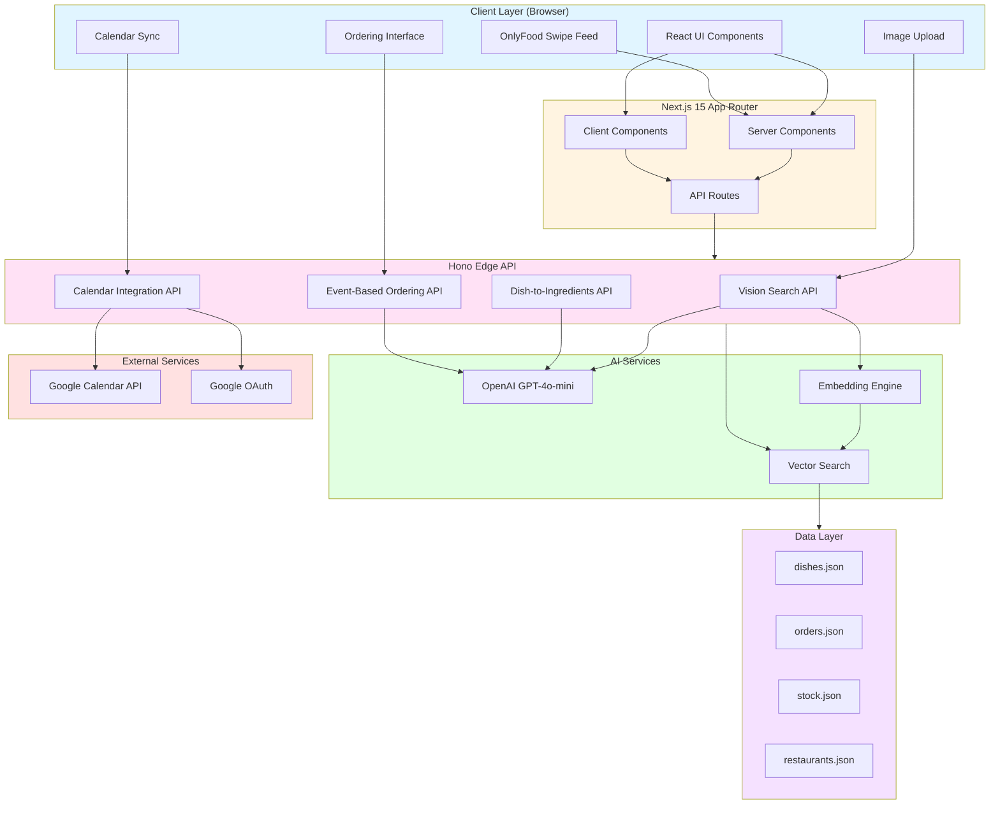
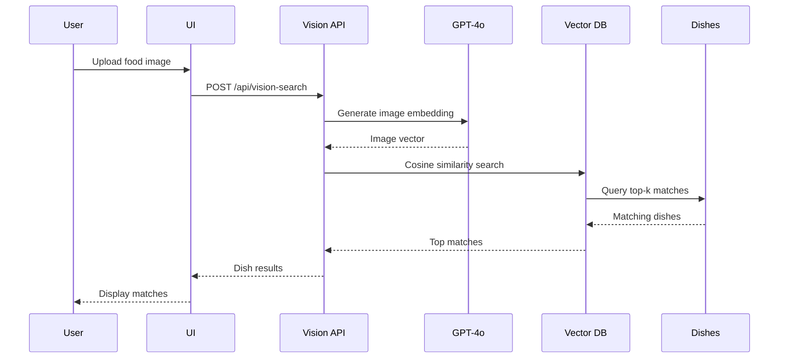
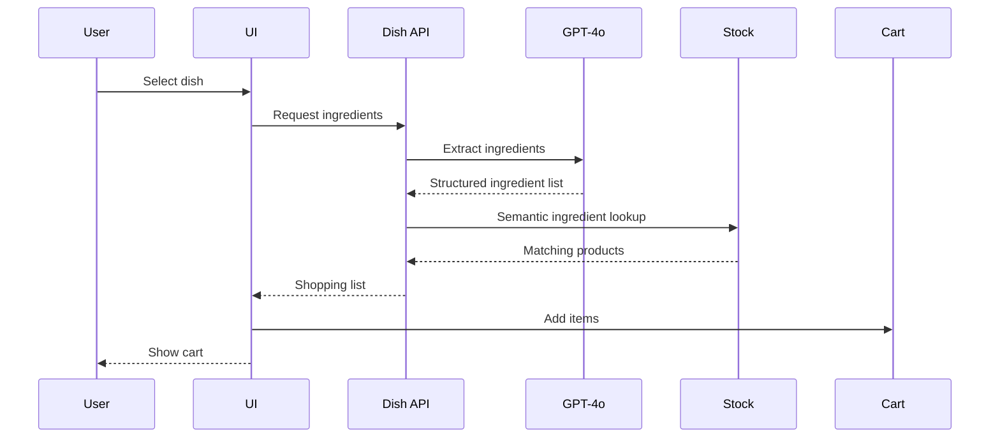
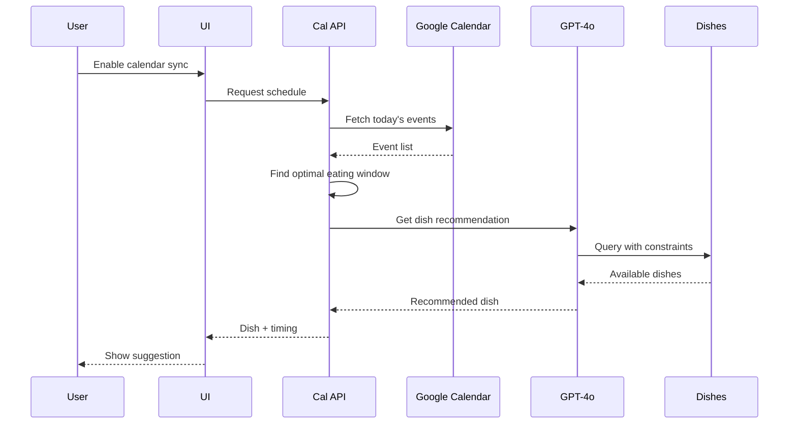
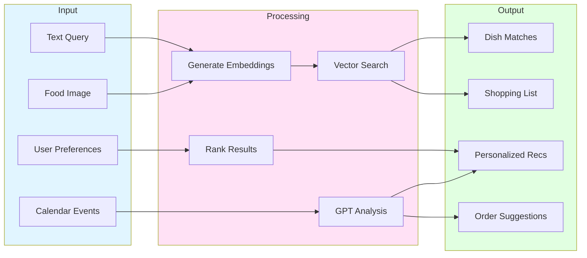
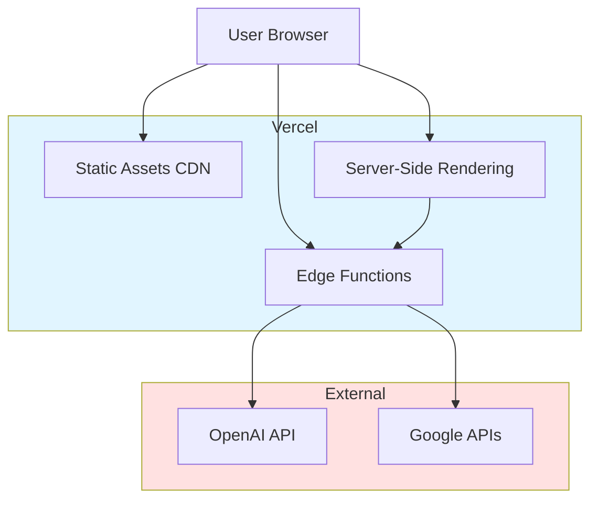

# Zaglot System Architecture

## High-Level Architecture

## Component Interactions

### 1. Image-Based Dish Recognition

### 2. AI Dish-to-Ingredients Pipeline

### 3. Calendar-Aware Ordering

## Data Flow

## Technology Stack by Layer

### Frontend
- **Framework**: Next.js 15 (App Router)
- **UI Library**: React 19
- **Styling**: Tailwind CSS + shadcn/ui
- **State Management**: TanStack Query
- **Authentication**: NextAuth (Google OAuth)

### Backend
- **API Framework**: Hono (Edge runtime)
- **Runtime**: Vercel Edge Functions
- **Validation**: Zod

### AI/ML
- **LLM**: OpenAI GPT-4o-mini
- **Embeddings**: OpenAI text-embedding-3-small
- **Vector Search**: In-memory cosine similarity

### External APIs
- **Calendar**: Google Calendar API
- **Authentication**: Google OAuth 2.0

### Data Storage
- **Type**: JSON-based mock data
- **Files**: dishes.json, orders.json, stock.json, restaurants.json
- **Embeddings**: Pre-computed vectors stored with entities

## Deployment Architecture

