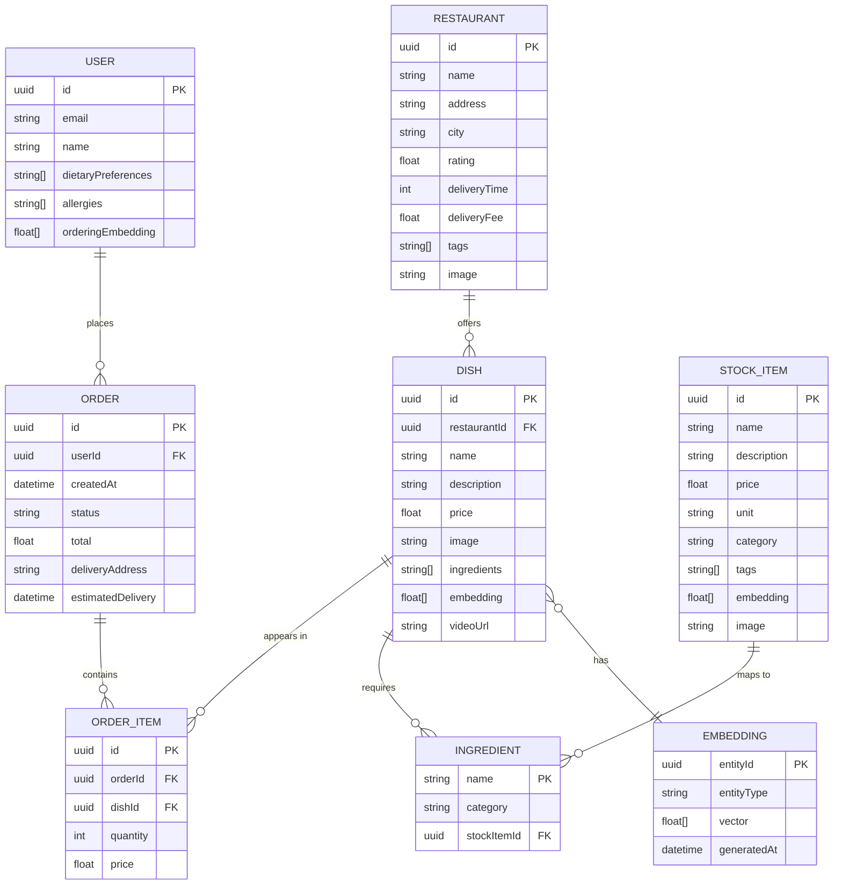
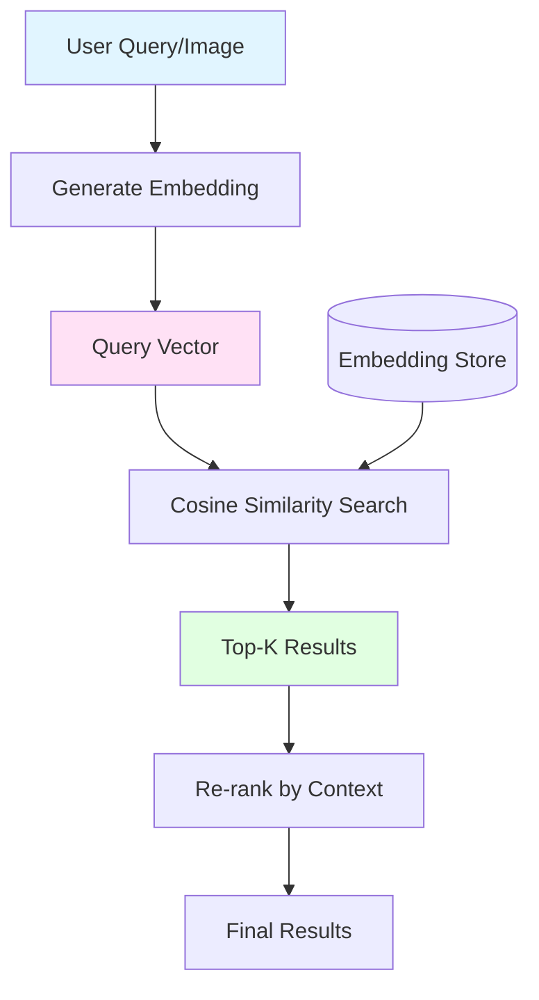

# Zaglot Data Model & Schema

## Entity Relationship Diagram



## Data Models

### Restaurant Model
Represents food establishments offering dishes through the platform.

```typescript
interface Restaurant {
  id: string;                    // UUID
  name: string;                  // Restaurant name
  address: string;               // Physical address
  city: string;                  // City location
  rating: number;                // 0-5 rating
  deliveryTime: number;          // Minutes
  deliveryFee: number;           // Currency
  tags: string[];                // e.g., ["Italian", "Pizza", "Fast"]
  image: string;                 // URL to restaurant image
}
```

### Dish Model
Individual menu items with AI-generated embeddings for semantic search.

```typescript
interface Dish {
  id: string;                    // UUID
  restaurantId: string;          // Foreign key to Restaurant
  name: string;                  // Dish name
  description: string;           // Detailed description
  price: number;                 // Currency
  image: string;                 // URL to dish image
  ingredients: string[];         // List of ingredient names
  embedding: number[];           // 768-dim vector (text-embedding-3-small)
  videoUrl?: string;             // Optional short-form video
}
```

### Order Model
Customer orders containing multiple dishes.

```typescript
interface Order {
  id: string;                    // UUID
  userId: string;                // Foreign key to User
  createdAt: string;             // ISO 8601 timestamp
  status: OrderStatus;           // "pending" | "preparing" | "delivered"
  total: number;                 // Total cost
  deliveryAddress: string;       // Delivery location
  estimatedDelivery: string;     // ISO 8601 timestamp
  items: OrderItem[];            // Array of order items
}

interface OrderItem {
  id: string;                    // UUID
  orderId: string;               // Foreign key to Order
  dishId: string;                // Foreign key to Dish
  quantity: number;              // Quantity ordered
  price: number;                 // Price at time of order
}
```

### Stock Item Model
Products available in Zaglot Market for ingredient ordering.

```typescript
interface StockItem {
  id: string;                    // UUID
  name: string;                  // Product name
  description: string;           // Product description
  price: number;                 // Currency
  unit: string;                  // e.g., "kg", "pc", "L"
  category: string;              // e.g., "Vegetables", "Dairy"
  tags: string[];                // Searchable tags
  embedding: number[];           // 768-dim vector
  image: string;                 // URL to product image
}
```

### User Model
User profile with preferences and ML-generated embeddings.

```typescript
interface User {
  id: string;                    // UUID
  email: string;                 // User email
  name: string;                  // Display name
  dietaryPreferences: string[];  // e.g., ["vegetarian", "gluten-free"]
  allergies: string[];           // e.g., ["peanuts", "shellfish"]
  orderingEmbedding: number[];   // Learned preference vector
}
```

## Embedding Strategy

All embeddings use **OpenAI text-embedding-3-small** (768 dimensions).

### Dish Embeddings
Generated from concatenated dish information:
```
name + " - " + description + " Ingredients: " + ingredients.join(", ")
```

### Stock Item Embeddings
Generated from product details:
```
name + " - " + description + " Category: " + category + " Tags: " + tags.join(", ")
```

### User Embeddings
Generated from aggregated order history:
```
"User preferences: " + aggregatedDishNames + " Dietary: " + dietaryPreferences.join(", ")
```

## Vector Search Implementation



### Cosine Similarity Calculation

```typescript
function cosineSimilarity(vecA: number[], vecB: number[]): number {
  const dotProduct = vecA.reduce((sum, a, i) => sum + a * vecB[i], 0);
  const magA = Math.sqrt(vecA.reduce((sum, a) => sum + a * a, 0));
  const magB = Math.sqrt(vecB.reduce((sum, b) => sum + b * b, 0));
  return dotProduct / (magA * magB);
}
```

## Data Relationships

### One-to-Many Relationships
- **Restaurant → Dishes**: One restaurant offers many dishes
- **User → Orders**: One user can place many orders
- **Order → Order Items**: One order contains many items

### Many-to-Many Relationships
- **Dishes ↔ Ingredients**: Dishes require multiple ingredients; ingredients appear in multiple dishes
- **Stock Items ↔ Ingredients**: Ingredients can map to multiple stock items (e.g., "tomato" → multiple varieties)

### One-to-One Relationships
- **Dish → Embedding**: Each dish has one semantic embedding
- **Stock Item → Embedding**: Each stock item has one semantic embedding

## Data Files

### dishes.json
Contains ~50 dishes with pre-computed embeddings (768-dim vectors).

### stock.json / stock-with-embeddings.json
Contains ~100 grocery items available for ingredient ordering.

### orders.json
Sample order history for demonstration.

### restaurants.json
Restaurant metadata for dish filtering and display.

## Future Schema Considerations

### For Production Database (PostgreSQL/MongoDB)

1. **Add Indexes**
   - Embedding vector indexes (using pgvector or similar)
   - Foreign key indexes
   - Text search indexes

2. **Add Timestamps**
   - `createdAt`, `updatedAt` on all entities

3. **Add Soft Deletes**
   - `deletedAt` field for soft deletion

4. **Add Audit Trail**
   - Track changes to orders and user data

5. **Normalize Data**
   - Separate ingredient table
   - Separate category/tag tables with junction tables

6. **Add Caching Layer**
   - Redis for frequently accessed embeddings
   - CDN for images and videos
